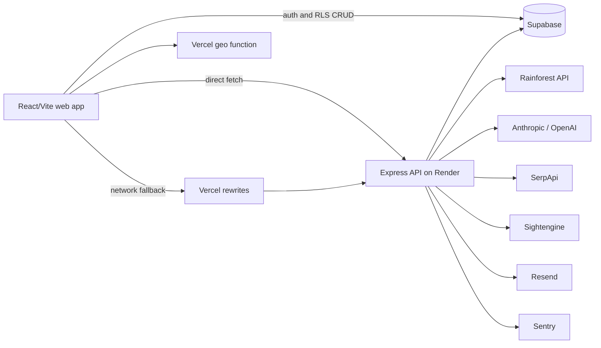

all# Focamai Existing Architecture Audit

**Audit date:** 2026-07-11
**Scope:** Current repository architecture; analysis only
**Evidence basis:** Repository source, tests, deployment configuration, and active project notes present at the audit date

## 1. Executive Summary

Focamai's architecture is healthy for its current product stage. It is a single JavaScript repository with a React/Vite web client, a Node/Express backend, shared deterministic constants and validation, Supabase persistence, and focused provider modules for Rainforest, Anthropic/OpenAI, SerpApi, Sightengine, and Resend. The guided-search design has several strong boundaries already: the server owns the candidate pool, deterministic filters surround AI decisions, shortlist enrichment is asynchronous, provider responses are normalized before presentation, and storage code is mostly separated by table responsibility.

The repository needs targeted cleanup and one main structural refactor, not a rewrite. `backend/lib/handlers/finalize-handler.js` (about 977 lines) is the clearest concentration of independent responsibilities. `src/components/home/useGuidedSearch.js` is also large (about 2,049 lines), but Git history shows a deliberate June 10 decomposition reduced it from about 2,202 to 1,715 lines by extracting constants/helpers, API fetchers, and result merging. Its later growth is mostly new guided-flow orchestration, diagnostics, and recovery behavior. The hook should remain intact unless a new, independently owned seam is proven. Express route ownership was consolidated on 2026-07-11; configuration parsing and database definitions remain the main cross-cutting cleanup opportunities.

There is no evidence that microservices, a queue, a new frontend framework, a large state library, or a generalized AI platform would improve the product now. A rewrite is **not warranted**.

The five highest-value recommendations are:

1. Split finalize validation/context resolution, shortlist selection, persistence, and background-job scheduling into cohesive services behind the existing handler contract.
2. Add characterization tests for the existing guided-search hook and finalize paths before their next significant behavior change.
3. Centralize parsed backend configuration with production-safe startup validation.
4. Add endpoint contract fixtures for discovery, finalize, enrichment, and safe error shapes.
5. Put the active Supabase schema into ordered, executable migrations and keep `db-needs.md` as an explanatory index rather than the deployable source of truth.

No P0 issue was confirmed. Most findings are P2. The finalize-boundary refactor, characterization tests, and migration discipline are P1 because ongoing product work will repeatedly touch those areas.

## 2. Current Architecture Map

### Applications and deployment

- **Web application:** React 19, React Router, Vite, TanStack Query, and Tailwind under `src/`. `src/main.jsx` boots the app; `src/App.jsx` owns route composition; `src/pages/HomePage.jsx` loads the guided homepage.
- **Backend:** Node/Express under `backend/`. Render, `npm run server`, and backend route tests use the single route map in `backend/express-server.js`; it delegates route behavior to handlers exported through `backend/server.js`.
- **Edge/same-origin layer:** Vercel hosts the frontend. `vercel.json` rewrites most `/api/*` paths to Render; `api/geo.js` remains a Vercel function for geolocation headers.
- **Mobile:** No mobile application source or mobile workspace was found in this repository. Active notes describe a mobile application as design inspiration, but mobile architecture cannot be audited from this repository alone.

### Major backend boundaries

- `backend/lib/handlers/`: HTTP-level discovery, refine, finalize, enrichment, diagnostics, analytics, account deletion, feedback, price comparison, product detail, and price-watch handlers.
- `backend/lib/rainforest-pipeline.js`: current Amazon retrieval and normalization path.
- `backend/lib/ai-selector.js`: shortlist selection prompts, schemas, parsing, deterministic fallback/top-up, and mini-enrichment-related AI behavior.
- `backend/lib/content-moderation.js` plus sensitive-image modules: deterministic query/result policy, OpenAI moderation, and Sightengine shadow/reveal processing.
- `backend/lib/storage/`: Supabase client and table-focused persistence adapters.
- `backend/lib/price-comparison/` and `backend/lib/price-watch/`: focused product comparison and price-watch provider/email logic.
- `shared/`: small cross-runtime modules for Amazon marketplace rules, ranking preference, and search input.

### Major frontend boundaries

- `src/components/home/useGuidedSearch.js`: guided-search lifecycle and most client-side orchestration.
- `src/components/home/guided-search/api.js`: endpoint request construction and response/error handling.
- `src/components/home/HomeExperience.jsx`: guided homepage composition.
- `src/components/home/ResultsSection.jsx` and `ProductDetailModal.jsx`: result and detail presentation.
- `src/lib/backendUrl.js`: direct-Render transport with same-origin Vercel fallback.
- `src/contexts/AuthContext.jsx` and `src/lib/supabase.js`: browser authentication.
- `src/lib/history/` and `src/lib/watch/watchStore.js`: local/remote history and browser-RLS price-watch persistence.

### External systems and storage

- Rainforest API: Amazon search and product details.
- Anthropic/OpenAI: refinement, shortlist selection/enrichment, query-quality/retry assistance, moderation, and transcription. Provider use varies by task rather than passing through one universal facade.
- Supabase: authentication, browser-RLS user data, server-side cache/analytics/diagnostics, rate-limit events, price watches, and sensitive-image verdicts.
- SerpApi: user-triggered price comparison.
- Sightengine: sensitive-image classification behind flags and persistent verdict caching.
- Resend: price-drop email delivery.
- Sentry: backend error reporting.

## 3. End-to-End Flow Analysis

### Guided product search

The flow begins in `HomeExperience.jsx` and `useGuidedSearch.js`. Discovery and refinement are started in parallel through `guided-search/api.js`. The browser calls `GET /api/search/rainforest-discover` and `GET /api/search/refine` using the transport in `src/lib/backendUrl.js`.

`handleRainforestDiscoverySearch()` in `backend/lib/handlers/discovery-handler.js` validates and moderates the query, resolves cache state, calls `rainforest-pipeline.js`, filters results, and stores a server-owned discovery snapshot. The response returns preview data and a discovery token, not authority for the browser to choose candidates. This is a strong trust boundary.

Refinement uses `backend/lib/handlers/refine-handler.js` and `refinement-assistant.js`. A local fallback keeps the flow usable when the AI request fails. The client can show preview products before finalize; preview and finalized picks remain explicitly different states.

On `POST /api/search/finalize`, `handleFinalizeSelection()` reads a size-limited body, rate-limits the client, resolves the server-owned discovery context, sanitizes the candidate pool again, applies exclusions and Prime constraints, invokes `haikuLockWinnersAndBadges()`, falls back or tops up deterministically, returns a six-item fast contract, persists the selection, and launches mini-enrichment/product-detail work in the background. The architecture correctly keeps ranking in the blocking path and explanations out of it.

The failure surface is broad: moderation, cache expiry, Rainforest availability, AI selection, Supabase writes, and enrichment can fail independently. The code has explicit timeouts, fallback selection, calm API errors, support/search IDs, diagnostic events, and SSE-to-polling fallback. The main weakness is that the frontend and finalize orchestrators encode many transitions in long imperative functions, so it is difficult to prove that every failure path resets the right state or records the right diagnostic event.

### Recommendation enrichment and product detail

After finalize, `backend/lib/handlers/enrichment-handler.js` runs mini writeups and detail hydration. `enrichment-bus.js` provides process-local updates; the client first opens `GET /api/search/enrichment-stream` and falls back to `GET /api/search/enrichment`. `useGuidedSearch.js` merges late data through helpers in `guided-search/result-merge.js`.

This separation is appropriate: enrichment cannot rerank winners and failure does not remove the shortlist. The process-local bus is adequate for the current single-service deployment because polling and persistent snapshots provide fallback behavior. It would become fragile across multiple Render instances if SSE subscribers and producers land on different instances. That is a future scaling condition, not a current reason to add a queue.

### Feedback and retry

User corrections start in the homepage hook and call `POST /api/search/retry-advice` through the dedicated API module. `retry-advice-handler.js` injects its dependencies from `backend/server.js`, validates generated suggestions through moderation, and returns a safe revised query. Search diagnostics preserve the support/search ID across the flow. The handler factory pattern here is notably testable and is a useful model for other boundary modules.

### Authentication, history, and preferences

`AuthContext.jsx` owns the Supabase browser session. Signed-out history is local through `src/lib/history/localHistoryStore.js`; signed-in history uses `remoteHistoryStore.js` and Supabase RLS. `historyStore.js` selects and migrates stores. Ranking preferences similarly use a small browser store plus the shared enum in `shared/ranking-preference.js`.

This is intentionally simple and avoids routing all user-owned CRUD through Render. Its security depends on deployed RLS policies matching `project-notes/db-needs.md`; repository inspection cannot prove the live Supabase policy state. Auth-bound server features such as Deep Dive independently verify bearer tokens with `backend/lib/auth.js`.

### Price comparison and price watches

`ProductDetailModal.jsx` triggers the account-gated `POST /api/product/deep-dive`. `deep-dive-handler.js` verifies the user, applies IP and account rate limits, proves the candidate belongs to a server-owned discovery snapshot, uses SerpApi through `price-comparison/deep-dive-serpapi.js`, validates retailer links, and caches provider layers separately.

Price watches use direct browser-RLS CRUD through `watchStore.js`. A protected internal endpoint invokes `backend/jobs/check-price-watches.js`, which reads active watches with the service client, batches Rainforest price checks, updates last-seen data, and sends Resend alerts only when enabled. Pure eligibility logic and provider/email boundaries are independently tested. This feature is better separated than the core finalize flow.

### Affiliate link generation

Marketplace and affiliate rules are centralized in `shared/amazon-marketplaces.js`; normalized results carry source/link data to UI helpers such as `src/lib/retailerLabel.js`. This is adequate for Amazon-first operation. A second retailer would expose Amazon-specific assumptions in names, domain context, cache scopes, and request fields, but a generic plugin framework is premature.

## 4. Architectural Strengths

1. **Server-owned candidate context.** Finalize reconstructs candidates from `discoveryToken` through `resolveDiscoveryContext()` rather than trusting a rich client payload. Deep Dive also proves candidate membership against cached search state.
2. **Deterministic rules surround AI.** Input limits, content policy, price eligibility, Prime handling, candidate-index mapping, validation, and fallback/top-up remain application code. AI explains or chooses within bounded schemas rather than owning business authority.
3. **Fast shortlist, late enrichment.** `layered-contracts.js` and `enrichment-handler.js` keep optional explanations and product details off the blocking path.
4. **Provider logic is reasonably localized.** Rainforest, SerpApi, Sightengine, Resend, and price-watch provider code have recognizable homes and tests.
5. **Storage has moved toward table-focused adapters.** `backend/lib/storage/` is clearer than raw Supabase calls spread through handlers. `search-storage.js` preserves older imports as a small facade.
6. **Resilience is proportionate.** Direct-backend plus same-origin fallback, timeouts, stale cache use where safe, rules fallback, SSE polling fallback, and feature kill switches address real failures without distributed infrastructure.
7. **Security controls are concrete.** Body/candidate limits, sanitization, rate limits, token verification, server-side secrets, RLS-owned browser data, link validation, and fail-closed sensitive-image reveal behavior are visible in code.
8. **Testing targets important behavior.** The repository contains about 62 test files, including handler, storage, rate-limit, provider-normalization, fallback, auth, search-state, and UI-flow tests. This is materially better than superficial snapshot coverage.
9. **Archived provider code is clearly separated.** Oxylabs lives under `backend/archive/oxylabs/` and active notes state that it is not a fallback.
10. **The single-service deployment fits current scale.** Render plus Vercel plus Supabase is understandable and operable. Nothing in the repository demonstrates a need for service decomposition.

## 5. Findings by Technical Area

### F1. Preserve the guided-search hook; guard its existing boundary

- **Current state:** `useGuidedSearch.js` owns the lifecycle of a single guided search: query/refinement state, discovery/finalize calls, constraint refresh, preview/final merging, enrichment SSE and polling, query-quality polling, retry flow, analytics/diagnostics, history persistence, modal detail hydration, Deep Dive state, timers, and scrolling coordination.
- **Evidence:** `src/components/home/useGuidedSearch.js` is about 2,049 lines. Git commits `3fbf4f5` and `ec600a2` deliberately extracted constants/helpers, eight API fetchers, and six result-merge functions on 2026-06-10, reducing the hook from about 2,202 to 1,715 lines. `445a2dc` separately extracted analytics/debug modules. The post-cleanup net growth is about 334 lines, driven chiefly by failure diagnostics (`b9690b2`, +214), reload recovery (`c33b5e3`, +55), and guided failure recovery (`f4f72c9`, +21).
- **Assessment and impact:** This history supports the repository rule in `AGENTS.md`: a stateful hook whose `useState`/`useRef` flows through the body should not be split merely for line count. The prior cleanup found and extracted the clear pure seams. The remaining code is largely orchestration, not evidence of a missed architecture layer.
- **Recommendation:** Keep the hook as the owner of the guided search lifecycle. Before its next substantial feature, add/maintain focused lifecycle tests for stale requests, abort/unmount, constraint refresh, enrichment fallback, retry, and once-only persistence. Extract only a newly proven independent responsibility; do not create a reducer, coordinator, or global state layer preemptively.
- **Category / priority / disruption / timing:** **Keep / Clarify; P2; low disruption; maintain during future guided-search work.**

### F2. Finalize handler mixes HTTP, domain selection, persistence, and background scheduling

- **Current state:** `handleFinalizeSelection()` performs body reading, rate limiting, diagnostic logging, cache resolution, sanitization, constraint policy, AI selection, fallback, response shaping, snapshot writes, recent-history mutation, product-detail fetching, and enrichment scheduling.
- **Evidence:** `backend/lib/handlers/finalize-handler.js` is about 977 lines and imports HTTP, ranking, AI, contracts, rate limiting, storage, discovery, product detail, helpers, and enrichment.
- **Assessment and impact:** The route is the product's most important backend boundary. Its safeguards are good, but changing selection or persistence requires understanding unrelated HTTP and enrichment behavior.
- **Recommendation:** Preserve the endpoint and response contract. Extract: (a) finalize request normalization/validation, (b) candidate-context preparation and deterministic constraint policy, (c) shortlist-selection service wrapping AI plus fallback, and (d) post-response persistence/enrichment scheduling. Use dependency injection selectively where tests need provider/storage substitution.
- **Category / priority / disruption / timing:** **Structural Refactor; P1; medium disruption; now after characterization tests.**

#### F2a. Extract finalize request/context resolution --done

- **Completed 2026-07-11:** Added `backend/lib/handlers/finalize-context.js`. It now owns the request-to-discovery-context path: request-context validation, cache-scope selection, discovery snapshot loading, and handoff of the validated candidate pool to the handler.
- **Preserved behavior:** `handleFinalizeSelection()` still owns HTTP responses, rate limiting, ranking/selection, persistence, diagnostics, and background enrichment. Endpoint paths and response shapes did not change.
- **Verification:** Added `finalize-context.test.js` for invalid requests, successful default-scope context loading, and invalid cached candidate pools. The focused finalize suite passes.
- **Remaining work:** Keep F2 open. Candidate-pool normalization, selection, persistence, and background scheduling remain in `finalize-handler.js` until each has a proven independent seam.

#### F2b. Extract single-candidate normalization --done

- **Completed 2026-07-12:** Added `backend/lib/handlers/finalize-candidate.js`. It now owns the pure conversion of one cached product candidate into the trusted finalize candidate shape, including field bounds, numeric coercion, Prime aliases, and nested signal defaults.
- **Preserved behavior:** Pool-size limits, known-price filtering, and the decision to reject an invalid cached pool remain in `finalize-handler.js`.
- **Verification:** Added `finalize-candidate.test.js` for required identity fields and normalized aliases/numeric signals. The focused candidate/context/finalize suite passes.
- **Remaining work:** Keep F2 open. Candidate-pool policy, AI selection, persistence, and background scheduling remain in `finalize-handler.js` until each has a proven independent seam.

### F3. Express route ownership was consolidated --done

- **Current state:** As of 2026-07-11, `backend/express-server.js` exports `createExpressApp()` and `createApiServer()`. Render, `npm run server`, and the server test use that Express route map. `backend/server.js` now composes and exports handlers only.
- **Evidence:** The native path/method dispatch was removed from `backend/server.js`; `backend/server.test.js` imports the Express-backed test server and verifies CORS preflight plus `/api/ping`.
- **Assessment and impact:** This removes route-drift risk without changing endpoint paths or handler contracts.
- **Recommendation:** Keep Express as the only route-registration location. Add a route-level smoke assertion whenever adding a new class of endpoint.
- **Category / priority / disruption / timing:** **Keep; completed 2026-07-11.**

### F4. Configuration parsing is distributed and deployment inventory is incomplete

- **Current state:** Environment values are read through `getEnv()` in many backend modules, directly from `process.env` in others, and from `import.meta.env` in the browser. Each feature parses booleans, numbers, defaults, and required values independently.
- **Evidence:** `render.yaml` lists core provider and watch variables but runtime code also uses rate-limit, Deep Dive, moderation, timeout, model, and other settings described across `db-needs.md` and feature notes. `express-server.js` reads `OPENAI_API_KEY` directly for transcription while most backend code uses `getEnv()`.
- **Assessment and impact:** Missing or malformed configuration is discovered only on the exercised route. It is hard to compare local, test, and Render behavior or know which flags are safe defaults.
- **Recommendation:** Add a small `backend/lib/config.js` that returns parsed feature configuration and a startup validation summary for required production dependencies. Keep optional features optional and report presence/status, never secret values. Add a generated-or-manually-maintained environment reference mapped to Render/Vercel ownership.
- **Category / priority / disruption / timing:** **Small Refactor; P2; low disruption; now.**

### F5. Database schema history is documentation-led rather than migration-led

- **Current state:** Active table SQL is embedded in `project-notes/db-needs.md`, with separate SQL for analytics and the sensitive-image verdict cache. Runtime storage adapters assume these shapes.
- **Evidence:** `db-needs.md` defines numerous tables and policies; `project-notes/analytics-funnel-schema.sql` and `plans/sightengine-verdict-cache-schema.sql` are separate. No ordered migration directory or automated schema application/verification workflow was found.
- **Assessment and impact:** It is difficult to reproduce a new environment, review schema evolution, or prove that production RLS and constraints match application assumptions. This is especially important because browser history, preferences, and watches depend directly on RLS.
- **Recommendation:** Establish an ordered Supabase migration history containing the existing active schema without redesigning it. Add a lightweight schema/RLS verification checklist or smoke query. Retain `db-needs.md` as the plain-language table ownership guide.
- **Category / priority / disruption / timing:** **Clarify initially, then Small Refactor; P1; medium operational disruption but low application disruption; now.**

### F6. API contracts are explicit in places but remain structurally duplicated

- **Current state:** `layered-contracts.js` defines the fast finalize shape and `guided-search/api.js` centralizes calls, but most endpoint payloads are plain objects validated separately on each side.
- **Evidence:** Candidate normalization exists in Rainforest/search modules, again in finalize sanitization, and in client result presentation/merge helpers. Shared modules currently cover only a few deterministic values.
- **Assessment and impact:** Some duplication is intentional because untrusted server input must be validated and UI presentation has different needs. The risk is silent field drift, not the absence of a schema library.
- **Recommendation:** Document canonical endpoint shapes and add contract fixtures/tests for discover, finalize, enrichment, and errors. Reuse small pure normalizers only where semantics are identical. Do not introduce code generation or a schema framework solely for type aesthetics.
- **Category / priority / disruption / timing:** **Clarify / Small Refactor; P2; low disruption; now alongside boundary refactors.**

### F7. AI conventions are spread across task modules

- **Current state:** AI responsibilities are organized by task (`ai-selector.js`, `refinement-assistant.js`, `query-quality-review.js`, `retry-advice.js`, moderation), but each module owns some combination of fetch/SDK calls, model selection, prompt construction, parsing, timeout, and logging.
- **Evidence:** `ai-selector.js` is about 739 lines; model environment names and fallback behavior appear in multiple modules. The selection path appropriately maps short AI indices back to server-owned candidates and keeps deterministic fallback.
- **Assessment and impact:** A universal provider abstraction would hide meaningful differences between moderation, selection, and copy generation. The current risk is inconsistent timeout/error/usage metadata and difficulty comparing AI calls operationally.
- **Recommendation:** Keep task-specific modules. Extract only a small call-conventions layer for correlation metadata, duration, model/provider naming, timeout classification, and safe error reporting. Add deterministic prompt/parse fixtures at each task boundary.
- **Category / priority / disruption / timing:** **Small Refactor; P2; low-to-medium disruption; after finalize boundaries stabilize.**

### F8. Observability is strong but has overlapping event models

- **Current state:** The backend uses console flow events, Sentry, analytics tables, `search_attempts`, and `search_events`; the frontend records analytics and diagnostic events with search/session IDs.
- **Evidence:** `observability.js`, `searchDiagnostics.js`, `searchAnalytics.js`, `analytics-storage.js`, and `search-diagnostics-storage.js` each cover related telemetry. Active notes distinguish analytics funnels from support-code diagnostics.
- **Assessment and impact:** The distinction is valid, but event naming and ownership are learned from code and notes. Duplicate emission or disagreement between “final status” records is possible.
- **Recommendation:** Define one event taxonomy document and a shared minimal envelope (`searchId`, `sessionId`, stage, status, source/provider, duration, safe error code). Keep analytics and diagnostics tables separate where retention and purpose differ. Do not purchase or add another observability platform now.
- **Category / priority / disruption / timing:** **Clarify; P2; low disruption; now.**

### F9. Process-local state should remain explicit

- **Current state:** Enrichment events, in-flight request deduplication, recent finalizations, memory cache fallback, and moderation penalty state are process-local. Supabase backs durable/shared concerns where configured.
- **Evidence:** `enrichment-bus.js`, `memory-cache.js`, `recentFinalizations` in server helpers, and in-flight sets in moderation/Deep Dive modules.
- **Assessment and impact:** This is appropriate for current cost and scale, provided production behavior does not assume one permanent process. Multi-instance deployment could reduce cache hits, lose recent-debug history, or split SSE producers from subscribers.
- **Recommendation:** Document which state is best-effort and process-local. Move a specific item to Supabase only when multiple instances or observed correctness failures require it. Enrichment already has polling/persistence fallback, reducing urgency.
- **Category / priority / disruption / timing:** **Keep / Clarify; P3; low now, potentially medium later; defer until multi-instance operation causes measurable failures.**

### F10. Security posture is proportionate; live policy state remains unverifiable

- **Current state:** Server endpoints validate bodies, rate-limit expensive work, verify bearer tokens for gated features, and use service credentials only server-side. Browser CRUD uses Supabase anon credentials and ownership RLS. External retailer links receive deterministic validation in price comparison.
- **Evidence:** `http.js`, `rate-limit.js`, `auth.js`, handler-specific limits, `retailer-link-validation.js`, and RLS SQL in `db-needs.md`.
- **Assessment and impact:** No confirmed critical secret exposure or authorization bypass was found. Production RLS/provider configuration cannot be proven from repository files, and service-key data access makes deployment correctness important.
- **Recommendation:** Add deployment-time verification of required RLS policies and protected internal endpoint configuration. Keep security tests focused on object ownership, candidate proof, body limits, rate limiting, and safe errors.
- **Category / priority / disruption / timing:** **Clarify; P2; low disruption; before broader account rollout.**

### F11. Test coverage is broad but core orchestration needs stronger characterization

- **Current state:** Vitest covers backend handlers/services and React behavior. There are focused tests for finalize helpers, discovery, content moderation, rate limiting, search snapshots, result merging, retry, constraint refresh, auth, watches, and provider parsing.
- **Evidence:** Approximately 62 test files were found. `backend/server.test.js` is itself very large; as of 2026-07-11 its route-level check starts the same Express-backed server used by Render and local development.
- **Assessment and impact:** Critical deterministic logic is protected, but the largest orchestration files remain risky to reshape. Handler-level tests should continue to cover important early-return branches as feature work changes them.
- **Recommendation:** Before refactoring, add table-driven finalize branch tests and hook lifecycle tests for stale requests, abort/unmount, refresh-before-finalize, enrichment fallback, retry, and persistence-once behavior. Add a small Express wiring smoke suite. Avoid coverage targets for their own sake.
- **Category / priority / disruption / timing:** **Small Refactor; P1; low disruption; first step before F2-F3.**

### F12. Documentation is unusually useful but deployment truth is fragmented

- **Current state:** `assistant-start.md`, `app_flow.md`, `search-flow.md`, `db-needs.md`, current status, and feature plans explain active behavior and guardrails. Some setup/deployment/environment knowledge is spread across those files, `render.yaml`, `vercel.json`, and code.
- **Evidence:** Active notes accurately describe the guided flow and distinguish implemented/deferred behavior. No concise developer-facing repository setup/deployment runbook was found in the inspected root files.
- **Assessment and impact:** AI/new-developer onboarding is strong for product behavior but weaker for reproducing infrastructure safely.
- **Recommendation:** Add only the targeted documents in Section 10 and link them from a repository overview. Avoid duplicating changelog history into architecture docs.
- **Category / priority / disruption / timing:** **Clarify; P2; low disruption; incrementally.**

## 6. Duplication and Coupling Report

| Case | Evidence | Decision |
|---|---|---|
| HTTP route maps | `express-server.js` is the sole route-registration location; `server.js` exports handlers | Keep the single Express route map. |
| Candidate/result normalization | Rainforest normalization, finalize sanitization, result merging, presentation helpers | Leave validation at trust boundaries; consolidate only identical pure field semantics and protect with fixtures. |
| Search telemetry | Frontend analytics, diagnostics, backend flow logs, two storage event models | Keep separate purposes; consolidate envelope/naming documentation. |
| Environment parsing | `getEnv()`, direct `process.env`, feature-local boolean/number parsing | Extract a small parsed configuration module. |
| Supabase access | Backend table adapters plus direct browser RLS stores | Leave alone: these represent different trust and ownership boundaries. |
| HTTP response compatibility | Handlers support Express and native response shapes through shared HTTP helpers | Simplify after one router is authoritative; do not redesign handlers first. |
| Amazon marketplace assumptions | `AmazonStoreContext`, `amazonDomain` request fields, Rainforest cache scopes, shared marketplace mapping | Keep for Amazon-first product; introduce a retailer-neutral search context only when retailer two is implemented. |
| Error logging | Handler-local flow logs plus `reportBackendError()` and diagnostic writes | Keep layers but standardize safe error codes and correlation fields. |

The strongest confirmed coupling is within the finalize handler, which crosses HTTP, selection, persistence, and background work. `useGuidedSearch` is a large but presently cohesive lifecycle owner after its prior extractions. Conversely, direct browser-to-Supabase code is not accidental coupling: for user-owned history, preferences, and watches it deliberately relies on Auth plus RLS and avoids unnecessary backend pass-through.

## 7. Simplification Opportunities

1. Keep the single Express route map instead of adding a router abstraction.
2. Replace repeated feature-local environment parsing with plain parsed config objects, not a dependency-injection container.
3. Keep `useGuidedSearch` as one lifecycle owner; strengthen its focused tests rather than adding a task coordinator without a demonstrated independent seam.
4. Turn finalize's repeated early-return logging/diagnostic/response sequences into a small response helper only where status semantics are identical.
5. Keep `search-storage.js` as a compatibility facade while new code imports focused adapters; retire re-exports only when callers naturally migrate.
6. Remove dormant/commented product policy from live handlers when a decision is final. The commented Deep Dive usage gate is an example of feature policy that would be clearer behind a named flag or in history, rather than a large commented block.
7. Keep archived experiments out of active module graphs. The existing `backend/archive/oxylabs/` approach is correct; apply the same rule to scripts whose environment names no longer represent active features.
8. Do not split cohesive provider modules solely because they are long. `rainforest-pipeline.js` and the price-watch job have recognizable single responsibilities and test seams.

## 8. Future-Readiness Assessment

- **Multiple retailers:** The normalized product/result shape and source-derived CTA provide a base, but `amazonDomain`, `AmazonStoreContext`, Rainforest cache scopes, ASIN-based detail/watch logic, and affiliate rules are Amazon-specific. Before retailer two, define a small `retailer + market + externalProductId` search context and adapter contract. Do this during a real second integration, not beforehand.
- **Premium reports:** The current tokenized discovery snapshot and async enrichment patterns are useful foundations. Reports that outlive an HTTP request would justify a persistent job state machine and external scheduler/worker. No queue is justified until reports actually need pause/resume, retries, or minutes-long execution.
- **Deeper diagnostics:** Existing correlation IDs and event tables are strong. Standardized event taxonomy and retention/PII rules are the main prerequisites, not a new platform.
- **Experimentation:** Feature flags currently come from environment variables, which is sufficient for global tester rollouts. User/cohort experiments would require assignment persistence and exposure logging; do not build this until a real experiment needs stable cohorts.
- **Personalization:** Shared ranking preference is clean and bounded. Learned preferences would need explicit data ownership/consent and evaluation; current search history should not be repurposed implicitly.
- **Multiple AI providers:** Task-specific AI modules can add a second provider where a measured reliability/cost need exists. First standardize call metadata and deterministic evaluation fixtures. A universal provider facade is not required.
- **International expansion:** Marketplace mapping already supports US/CA/India distinctions. Currency, localized policy/copy, provider availability, affiliate status, and Deep Dive/watch support must remain explicit per market. Avoid assuming that Amazon domain alone fully defines locale.
- **Web/mobile shared behavior:** No mobile source exists here, so duplication cannot be measured. Share stable schemas and deterministic rules through a package only when both repositories/modules can consume and test them; do not force shared React UI or state management.

## 9. Prioritized Refactoring Plan

### Phase 1 — Low-Risk Cleanup

Start with F11 characterization tests, then F4 configuration inventory/parsing, F6 contract fixtures, and F8 event taxonomy. Include lifecycle coverage around the existing `useGuidedSearch` hook, but do not refactor it merely because it is long. These changes create safety rails without changing product behavior.

- **Dependencies:** None beyond agreeing on current endpoint outputs.
- **Risks:** Tests may encode accidental behavior; fixtures must distinguish contract from implementation detail.
- **Expected benefit:** Safer subsequent refactors, faster configuration diagnosis, and less event ambiguity.
- **Validation:** Existing test suite remains green; new tests fail against intentionally malformed contracts/configuration; no response shape changes.
- **Do not change yet:** Ranking policy, provider selection, UI states, or storage schema.

### Phase 2 — Strengthen Core Boundaries

Implement F2 in small extractions. Backend finalize should move first because its contract can be characterized independently. The Express route consolidation is complete; retain its route-level smoke coverage. Revisit the guided-search hook only if a future feature produces a real independent module boundary.

- **Dependencies:** Phase 1 branch/flow coverage and contract fixtures.
- **Risks:** Timing, abort behavior, background scheduling, duplicate persistence, and diagnostic event ordering.
- **Expected benefit:** Smaller review surfaces, easier provider substitution in tests, and lower regression risk in the main search path.
- **Validation:** Identical contract fixtures, all current flow tests, Express smoke tests, manual guided search including preview/refine/finalize/enrichment/retry, and confirmation that background work runs once.
- **Do not change yet:** React state library, endpoint paths, AI model policy, or deployment topology.

### Phase 3 — Prepare for Near-Term Product Growth

Implement F5 executable migrations and RLS verification, then F7 AI call conventions and F10 deployment security checks. These are justified by existing auth/user data and provider breadth, rather than speculative scale.

- **Dependencies:** Inventory the live Supabase schema before creating baseline migrations; do not blindly replay table creation in production.
- **Risks:** Baseline migration drift and accidental policy changes. AI wrapper work can hide task-specific errors if made too generic.
- **Expected benefit:** Reproducible environments, safer account rollout, and comparable AI diagnostics.
- **Validation:** Fresh-project schema application, non-destructive production baseline procedure, RLS ownership tests, and unchanged task-specific AI fixtures.
- **Do not change yet:** Database vendor, auth provider, or a universal AI abstraction.

### Phase 4 — Deferred Until Scale or Complexity Justifies Them

Apply F9 only when multiple backend instances create observed cross-instance correctness failures. Introduce retailer-neutral context from Section 8 only when a second retailer is funded and scoped. Add durable report jobs only when premium reports exceed normal request lifetimes. Add persisted experiment assignment only when the team runs cohort experiments.

- **Dependencies:** A measured trigger for each item.
- **Risks:** Building early would add operational failure modes and maintenance cost.
- **Expected benefit:** Capacity or product flexibility at the point it becomes real.
- **Validation:** Define metrics before implementation (lost enrichment events, job duration/failure rate, second-retailer contract, or cohort consistency).
- **Do not change yet:** Do not add Redis, queues, microservices, plugin frameworks, or cross-app shared UI packages preemptively.

## 10. Recommended Targeted Documentation

1. **Repository overview:** runtime entry points, folder ownership, local commands, and links to the documents below.
2. **Search pipeline contract:** keep the existing `search-flow.md`, adding canonical discover/finalize/enrichment payload fixtures and ownership boundaries.
3. **AI-call conventions:** task, provider/model, timeout, schema/parsing, fallback, correlation metadata, and safe logging rules.
4. **Environment reference:** variable owner, runtime (browser/Render/Vercel), required/optional status, default, feature flag, and safe validation behavior.
5. **Deployment runbook:** Vercel-to-Render routing, health checks, rollback, scheduler setup, and masked configuration checks.
6. **Database migration/index:** executable migration order plus the existing plain-language table ownership and RLS expectations.
7. **Retailer integration guide:** defer until a second retailer is approved; then document the proven normalized contract and Amazon-specific exceptions.

## 11. Things Not to Do

- Do not rewrite the React frontend or Express backend. Their technologies are not the source of the identified problems.
- Do not split the backend into microservices. Search, enrichment, diagnostics, and price features currently benefit from one deployable and shared cache/context.
- Do not introduce a message broker or Redis for the process-local enrichment bus until multi-instance behavior causes measured failures.
- Do not replace Supabase. Its auth, RLS, and server storage roles fit the current product; migration discipline is the missing piece.
- Do not add Redux or another global state framework merely to reduce `useGuidedSearch.js`. The existing hook should remain the owner unless a future change proves a separate stateful responsibility.
- Do not build a generalized retailer plugin framework before retailer two. Extract the smallest interface from the real second adapter.
- Do not build a full internal AI platform. Standardize call metadata and tests while preserving task-specific prompts and fallbacks.
- Do not share web and mobile UI code prematurely. The mobile implementation is not present here, so the stable common boundary is not yet evidenced.
- Do not make enrichment synchronous or allow it to rerank finalized winners; the current fast-contract boundary is a product and reliability strength.
- Do not merge analytics and support diagnostics into one table merely because their envelopes overlap; their purposes and likely retention differ.

## 12. Final Recommendation Table

| Recommendation | Evidence | Category | Priority | Disruption | Timing |
|---|---|---|---|---|---|
| Preserve `useGuidedSearch` and protect its lifecycle with focused tests | June 10 extractions reduced it ~2,202 → 1,715 lines; later +334 lines are mostly diagnostics/recovery orchestration | Keep / Clarify | P2 | Low | During future guided-search work |
| Extract finalize request/context resolution --done | `finalize-context.js` now validates the request, resolves discovery cache scopes, and hands back the validated candidate pool | Small Refactor | P1 | Low | Completed 2026-07-11 |
| Extract single-candidate normalization --done | `finalize-candidate.js` now owns bounded field normalization and default signals for one cached candidate | Small Refactor | P1 | Low | Completed 2026-07-12 |
| Decompose finalize behind the current endpoint contract | 977-line handler spans HTTP, policy, AI, persistence, and background work | Structural Refactor | P1 | Medium | After characterization tests |
| Add orchestration characterization and Express wiring tests | 62 test files, but native-router integration tests did not exercise the production Express wiring | Small Refactor | P1 | Low | First |
| Establish executable Supabase migrations and RLS verification | Active SQL is split across notes and standalone files | Clarify / Small Refactor | P1 | Medium operational | Near term |
| Keep the single Express route map --done | `express-server.js` now owns routes; Render, local server, and backend route tests use it | Keep | — | Completed | 2026-07-11 |
| Centralize parsed configuration and startup validation | Distributed `getEnv`, `process.env`, and feature-local parsing; incomplete deployment inventory | Small Refactor | P2 | Low | Phase 1 |
| Add endpoint contract fixtures and canonical shape documentation | Layered contracts exist, but normalization/validation is repeated across boundaries | Clarify / Small Refactor | P2 | Low | Phase 1 |
| Standardize AI call metadata, timeout classification, and fixtures | Task modules own inconsistent call mechanics; `ai-selector.js` is 739 lines | Small Refactor | P2 | Low–Medium | Phase 3 |
| Define one telemetry envelope and event taxonomy | Analytics, diagnostics, Sentry, and flow logs overlap | Clarify | P2 | Low | Phase 1 |
| Verify live RLS and protected endpoint configuration | Security controls are present, but deployed policy state is not provable from the repo | Clarify | P2 | Low | Before broader account rollout |
| Add a small deployment/setup documentation set | Product-flow notes are strong; operational truth is distributed | Clarify | P2 | Low | Incremental |
| Keep process-local state until multi-instance failures are measured | Enrichment bus, in-flight sets, and recent history are local with existing fallbacks | Keep / Clarify | P3 | Low now | Defer to measured trigger |
| Introduce retailer-neutral context only with retailer two | Current internals are partly normalized but market/domain/ASIN flow is Amazon-specific | Defer | P3 | Medium | Second retailer |
| Add durable report jobs only for long-running premium reports | No current durable premium-report execution flow exists | Defer | P3 | High | When request lifetime is insufficient |

### Audit limitations

- Live Render, Vercel, Supabase, provider dashboards, RLS state, traffic volume, costs, and production logs were not inspected; conclusions about them are limited to repository configuration and notes.
- No mobile application code was present, so web/mobile duplication and mobile trust boundaries cannot be verified.
- No production load profile was available. Scaling recommendations are therefore deliberately trigger-based.
