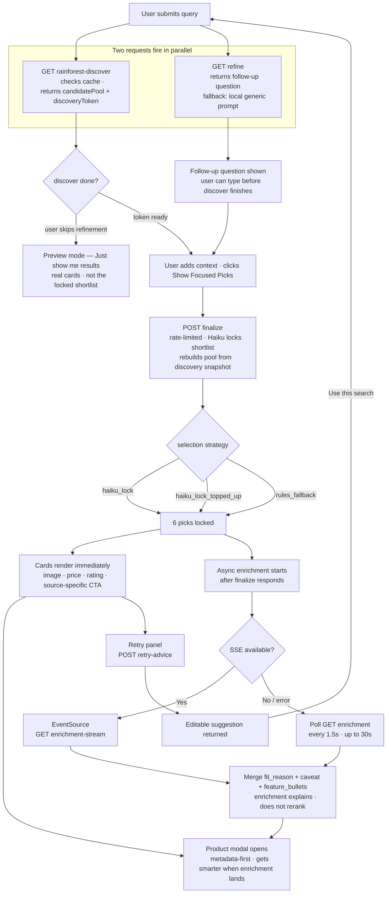

# Focamai Search Flow

Quick-reference diagram. For full step-by-step detail and guardrails, see `search-flow.html`.

Production note (2026-08-27): the atomic Supabase rate-limit RPC is repaired by `20260827225123_repair_atomic_rate_limit_timestamp.sql`. The former `current_time` variable collided with PostgreSQL `CURRENT_TIME`, produced time-only values, and caused SQLSTATE `22007`; the production repair now returns a full `timestamptz`. Bounded fallback remains required because measured Supabase rate-limit and session stages can still add roughly two seconds to a cache hit.

Finalize timing note (2026-08-31): the awaited token-scoped finalized-snapshot write is reported separately as `persistence` and included in the true `total` stage. The write remains blocking while production timing is collected; initial configured-Supabase measurements were usually about 0.2-0.3 seconds with one 1.69-second tail, so no trust/durability behavior has been changed yet.

## Key rules at a glance

| Rule | One line |
|---|---|
| Candidate pool is server-owned | Browser sends token · finalize reconstructs from snapshot; clear named brands/models are hard-filtered before AI selection |
| Session trust stays server-owned | Preview does not await persistence; recent-token finalize briefly polls if needed and never trusts the browser candidate pool |
| Shortlist stays at 6 | Preview can be broader · guided output is always 6; a false Haiku specific-brand decision favors no more than two models per brand where credible alternatives exist, while explicit named-brand queries override it |
| Finalize is thin | Haiku locks in the blocking path using product fit before quality confidence, value, variety, and Amazon position · product detail stays async |
| Preview ≠ focused picks | `Just show me results` is not the guided shortlist |
| Enrichment explains, not reranks | Async work adds hero/alternative fit reasons and caveats · winners don't change |
| Amazon-first UX, flexible internals | Current UI may name Amazon when Amazon is the active source · backend/provider logic and normalized product data stay flexible |
| Amazon discovery provider order | Rainforest API is the active Amazon discovery provider; Oxylabs is archived and not an active fallback |
